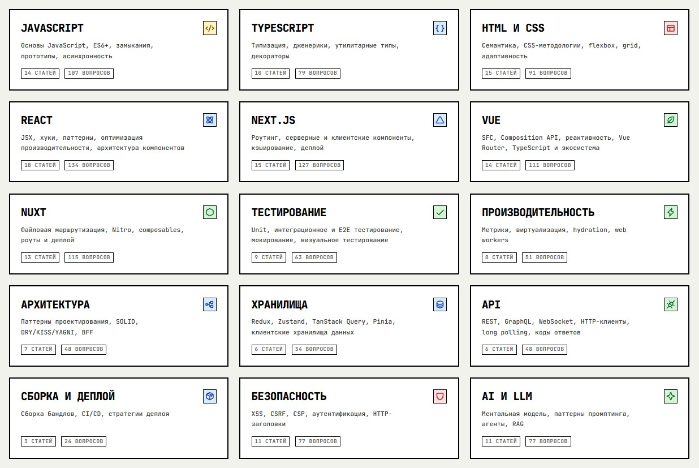

# <p align="center">Prepra</p>

<p align="center">
  <strong>Интерактивная платформа для подготовки к фронтенд-собеседованию</strong>
</p>

<p align="center">
  
</p>

<p align="center">
  
  
  
  
  
</p>

---

## Содержание

- [Обзор проекта](#обзор-проекта)
- [Возможности](#возможности)
- [Технологический стек](#технологический-стек)
- [Быстрый старт](#быстрый-старт)
  - [Требования](#требования)
  - [Установка](#установка)
  - [Запуск](#запуск)
- [Использование](#использование)
  - [Структура проекта](#структура-проекта)
  - [Добавление новой статьи](#добавление-новой-статьи)
  - [Доступные команды](#доступные-команды)
- [Конфигурация](#конфигурация)
- [Разработка](#разработка)
- [Деплой](#деплой)
- [Лицензия](#лицензия)

---

## Обзор проекта

**Prepra** — это структурированная образовательная платформа для самостоятельной подготовки frontend-разработчиков к техническим собеседованиям с трекером прогресса, системой самопроверки и понятным learning roadmap. Это **более 170 учебных статей** в 15 разделах, лично проверенных автором. Платформа охватывает всю современную frontend-разработку — от основ JavaScript до AI/LLM.

Проект построен на связке Astro и React: контент пишется на чистом markdown и рендерится через content collections. Автор занимается текстом, а сайт сам строит роутинг, темы и интерактивные элементы.

> [!NOTE]
> Опубликованная версия сайта доступна по адресу [https://nightrunner91.github.io/prepra](https://nightrunner91.github.io/prepra).

---

## Возможности

- **Генерация статического сайта** на Astro: быстрые страницы, SEO и минимум клиентского JavaScript.
- **Контент в Markdown** через Astro Content Collections с типизированной схемой frontmatter.
- **Интерактивный трекер прогресса** на `localStorage`: отмечай вопросы как "знаю", "частично" или "не знаю".
- **Оверлей с вопросами для самопроверки** в конце каждой статьи для active recall.
- **Индикатор прогресса чтения** при скролле статьи.
- **Вопрос дня** на главной странице для интервального повторения.
- **Тёмная и светлая темы** на Tailwind CSS и CSS custom properties.
- **Адаптивный интерфейс** с боковой панелью разделов, хлебными крошками и оглавлением.
- **Автоматические проверки качества** через Lighthouse CI в каждом pull request.
- **Автоматический деплой** на GitHub Pages и preview-окружения для PR.

---

## Технологический стек

| Категория | Технология | Назначение |
|-----------|------------|------------|
| Фреймворк | [Astro 5](https://astro.build/) | Статическая генерация сайта и content collections |
| Компоненты | [React 19](https://react.dev/) | Интерактивные острова (квизы, прогресс, переключатель темы) |
| Язык | [TypeScript](https://www.typescriptlang.org/) | Типобезопасные компоненты и схемы контента |
| Стили | [Tailwind CSS 3](https://tailwindcss.com/) | Utility-first адаптивная стилизация |
| Контент | [MDX / Markdown](https://docs.astro.build/en/guides/markdown-content/) | Статьи с frontmatter |
| Анимации | [GSAP](https://gsap.com/) | Плавные UI-анимации |
| Иконки | [Phosphor Icons](https://phosphoricons.com/) | Единообразная иконография |
| Хостинг | [GitHub Pages](https://pages.github.com/) | Бесплатный статический хостинг с CDN |
| CI/CD | [GitHub Actions](https://github.com/features/actions) | Сборка, деплой, preview и Lighthouse-проверки |

---

## Быстрый старт

### Требования

- [Node.js](https://nodejs.org/) 20 или новее
- [npm](https://www.npmjs.com/) (устанавливается вместе с Node.js)

### Установка

1. Клонируй репозиторий:

   ```bash
   git clone https://github.com/nightrunner91/prepra.git
   cd prepra
   ```

2. Установи зависимости сайта:

   ```bash
   cd site
   npm install
   ```

### Запуск

Запусти dev-сервер:

```bash
npm run dev
```

Открой [http://localhost:8305/prepra](http://localhost:8305/prepra) в браузере.

> [!NOTE]
> Сайт развёртывается по базовому пути `/prepra`, чтобы соответствовать настройкам деплоя на GitHub Pages.

---

## Использование

### Структура проекта

```text
prepra/
├── .github/workflows/       # CI/CD workflow-файлы
│   ├── deploy.yml           # Продакшен-деплой на GitHub Pages
│   ├── lighthouse.yml       # Lighthouse CI в pull request
│   └── pr-preview.yml       # Preview-окружения для PR
├── docs/                    # Исходные markdown-статьи (177+)
│   ├── javascript/
│   ├── typescript/
│   ├── react/
│   ├── vue/
│   ├── nextjs/
│   ├── nuxt/
│   ├── testing/
│   ├── performance/
│   ├── architecture/
│   ├── state-management/
│   ├── api-communication/
│   ├── build-and-deployment/
│   ├── security/
│   └── ai/
├── site/                    # Astro-приложение
│   ├── src/
│   │   ├── components/      # Компоненты Astro и React
│   │   ├── content/
│   │   │   └── config.ts    # Схемы content collections
│   │   ├── layouts/         # Layout-компоненты
│   │   ├── lib/             # Утилиты (URL, разделы, парсер readme)
│   │   ├── pages/           # Роуты Astro
│   │   └── styles/          # Глобальные стили и CSS-токены
│   ├── astro.config.mjs
│   ├── tailwind.config.js
│   └── tsconfig.json
├── LICENSE
└── README.md
```

> [!IMPORTANT]
> Контент статей хранится в `/docs`, а не внутри Astro-проекта. Схема content collections в `site/src/content/config.ts` загружает markdown-файлы из `../docs/{section}`.

### Добавление новой статьи

1. Создай markdown-файл в нужном разделе `/docs`, например:

   ```text
   docs/react/react-server-components.md
   ```

2. Добавь обязательный frontmatter в начало файла:

   ```yaml
   ---
   title: "React Server Components"
   section: react
   description: "Как серверные компоненты уменьшают клиентский бандл и упрощают загрузку данных."
   order: 12
   tags: ["rsc", "nextjs", "server-components"]
   questions:
     - Какую проблему решают React Server Components?
     - Чем серверные компоненты отличаются от клиентских?
     - Когда использовать директиву 'use client'?
   ---
   ```

3. Запусти dev-сервер и открой `/prepra/react/react-server-components/`, чтобы проверить статью.

### Доступные команды

Все команды выполняются из директории `site/`.

| Команда | Описание |
|---------|----------|
| `npm run dev` | Запустить Astro dev-сервер на порту `8305` |
| `npm start` | Псевдоним для `npm run dev` |
| `npm run build` | Собрать статический сайт в `site/dist` |
| `npm run preview` | Локальный предпросмотр продакшен-сборки |
| `npm run astro` | Запустить Astro CLI напрямую |

---

## Конфигурация

Ключевые конфигурационные файлы:

- **`site/astro.config.mjs`** — настройки Astro: `output: 'static'`, `site`, `base: '/prepra'`, интеграции и темы Shiki.
- **`site/tailwind.config.js`** — токены темы Tailwind, кастомные цвета, шрифты и плагин типографики.
- **`site/tsconfig.json`** — пути TypeScript и настройки JSX.
- **`site/src/content/config.ts`** — схема Zod и определения content collections для всех 15 разделов.
- **`site/lighthouserc.js`** — пороговые значения Lighthouse CI и целевые URL.

> [!NOTE]
> Для локальной разработки и продакшен-сборки не требуются переменные окружения. Прогресс сохраняется в `localStorage` браузера и не синхронизируется с бэкендом.

---

## Разработка

1. Убедись, что ты находишься в директории `site/`.
2. Запусти `npm run dev` для локального сервера.
3. Редактируй компоненты в `site/src/components/`, layout в `site/src/layouts/` или статьи в `/docs`.
4. Astro dev-сервер автоматически перезагружает изменения.

> [!TIP]
> Перед созданием pull request запусти `npm run build`, чтобы заранее отловить ошибки TypeScript или схемы контента.

---

## Деплой

Проект использует GitHub Actions для непрерывного деплоя:

| Workflow | Триггер | Назначение |
|----------|---------|------------|
| `deploy.yml` | Push в `main` или ручной запуск | Сборка и деплой сайта на GitHub Pages |
| `lighthouse.yml` | Pull request в `main` | Запуск Lighthouse CI и проверка порогов качества |
| `pr-preview.yml` | События pull request | Деплой preview-URL для каждого PR |

Продакшен-сайт размещён по адресу [https://nightrunner91.github.io/prepra](https://nightrunner91.github.io/prepra).

---

## Лицензия

Этот проект распространяется под лицензией [GNU Affero General Public License v3.0](LICENSE) (AGPL-3.0).

> [!IMPORTANT]
> AGPL-3.0 требует, чтобы любой публично развёрнутый модифицированный вариант проекта также публиковал свой исходный код. Подробности — в файле [LICENSE](LICENSE).

---

<p align="center">
  Сделано с ❤ <a href="https://t.me/nightrunner91">nightrunner91</a>
</p>
