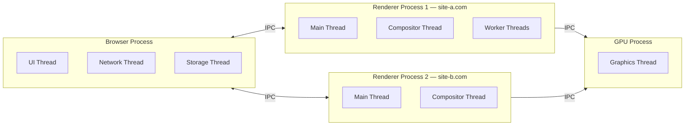
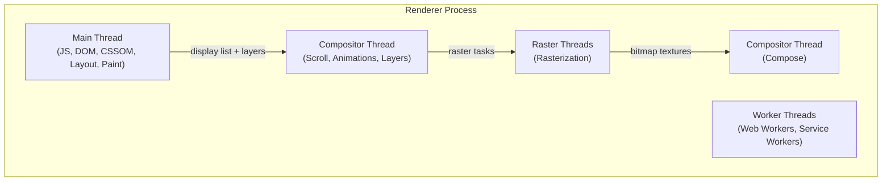
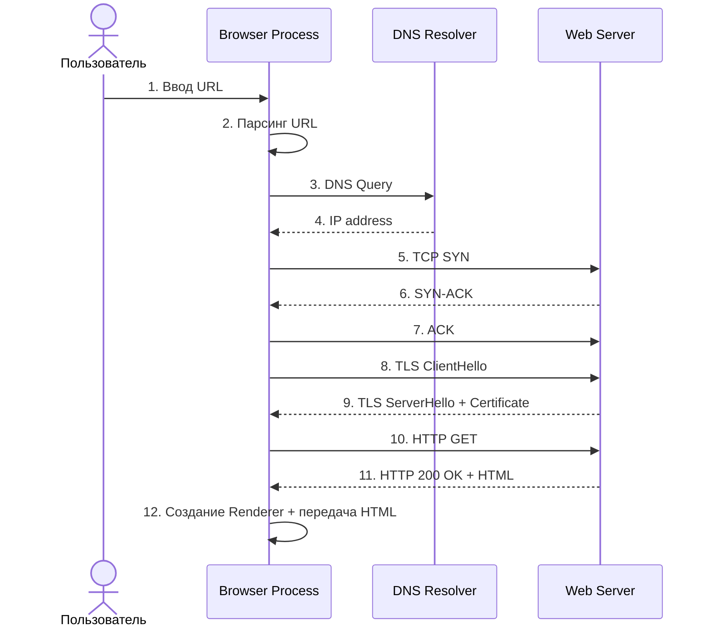
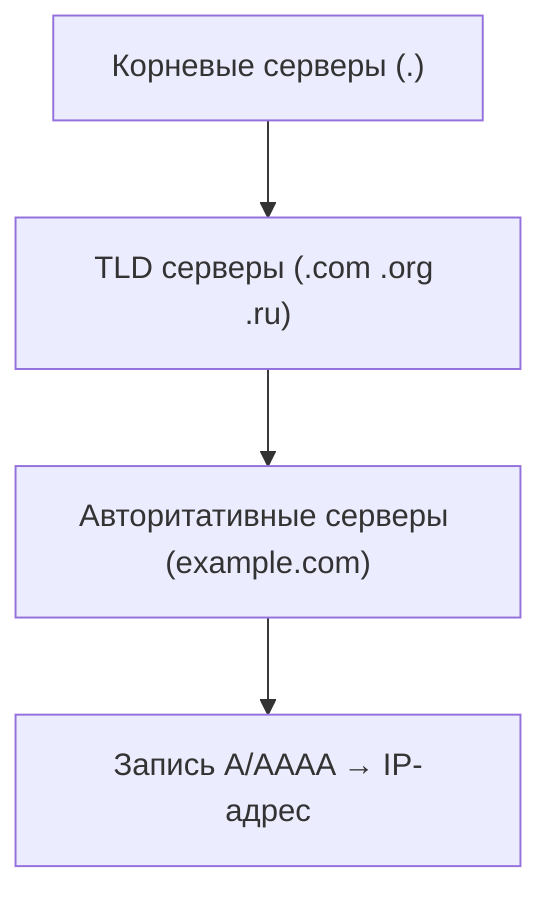
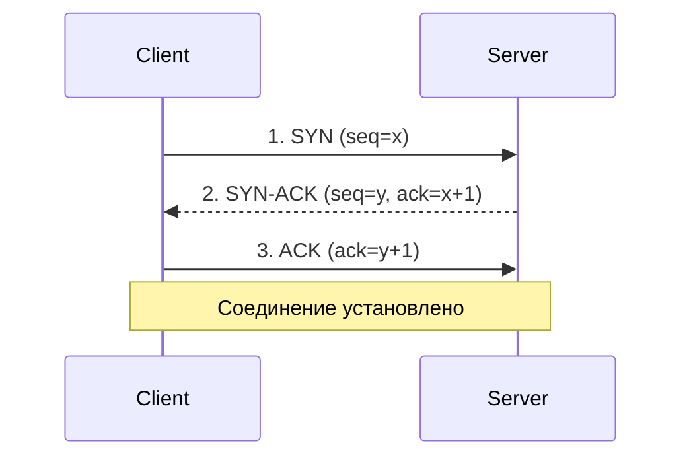
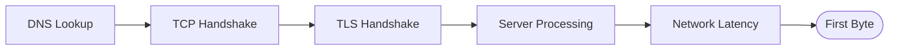

---
title: "Браузерная архитектура: процессы, потоки, сеть"
section: performance
description: "Современный браузер — это многопроцессная система с изолированными renderer-процессами, GPU-ускорением и строгой моделью безопасности. Разбираем процессы, потоки, Site Isolation и сетевой путь от ввода URL до первого байта ответа."
order: 3
tags: ["browser-process", "renderer-process", "site-isolation", "ttfb", "dns", "tcp", "tls"]
questions:
  - "Как устроена многопроцессная архитектура браузера и почему Site Isolation увеличивает потребление памяти"
  - "Чем занимаются Browser Process, Renderer Process, GPU Process и Utility Process"
  - "Как устроены потоки внутри renderer-процесса: Main Thread, Compositor Thread, Raster Threads, Worker Threads"
  - "Какой путь проходит запрос от ввода URL до получения HTML: DNS, TCP, TLS, HTTP"
  - "Из чего складывается TTFB и как его уменьшить"
  - "Как связаны браузерная архитектура и критический путь рендеринга"
answers:
  - "Браузер делит работу между процессами: Browser Process — UI, навигация и хранилища, Renderer Process — рендеринг вкладки, GPU Process — графика. Site Isolation даёт каждому origin отдельный renderer-процесс (защита от Spectre), но накладные расходы — V8 heap, стеки потоков — умножаются на число изолированных сайтов, а IPC медленнее внутрипроцессных вызовов."
  - "Browser Process управляет UI браузера, навигацией, сетевыми запросами и хранилищами (cookies, localStorage, IndexedDB) и имеет повышенные привилегии; Renderer Process парсит HTML/CSS, выполняет JS и строит DOM/CSSOM, layout и paint вкладки; GPU Process растеризует слои и компонует кадр через видеокарту; Utility Process выполняет вспомогательные задачи — audio, network, storage service."
  - "Main Thread выполняет JS, парсит HTML/CSS и делает layout/paint; Worker Threads обслуживают Web/Service Workers; Compositor Thread независимо от main thread управляет скроллом и анимациями, поэтому transform/opacity остаются плавными даже при загруженном основном потоке; Raster Threads растеризуют слои в пиксели параллельно с композитингом."
  - "Сначала парсинг URL и проверка HSTS/DNS-кэша, затем DNS resolution (браузер → OS → роутер → рекурсивный сервер → root → TLD → authoritative) до IP, TCP three-way handshake (1 RTT), TLS handshake (1 RTT в TLS 1.3), HTTP-запрос и ответ 200, после чего Browser Process передаёт HTML в renderer-процесс с учётом Site Isolation."
  - "TTFB = DNS lookup + TCP handshake + TLS handshake + Server Processing + Network Latency. Уменьшают его кэшированием на сервере (Redis, nginx proxy_cache), CDN ближе к пользователю, HTTP/2 или HTTP/3, DNS prefetch и keep-alive для переиспользования TCP-соединения."
  - "Renderer-процесс получает HTML от Browser Process и запускает критический путь на Main Thread: DOM → CSSOM → Render Tree → Layout → Paint, а финальную сборку кадра выполняют Compositor Thread и GPU Process. Поэтому занятый Main Thread блокирует JS, layout и paint, а transform/opacity анимируются на композиторе независимо от него."
---

# Браузерная архитектура: процессы, потоки, сеть

Современный браузер — это не один процесс, а сложная многопроцессная система, где каждый сайт изолирован в собственном renderer-процессе. Понимание этой архитектуры объясняет, почему одни операции дороги, а другие выполняются без участия основного потока, а также как страница попадает с сервера в браузер.

> Детали превращения HTML в пиксели — DOM, CSSOM, Render Tree, Layout, Paint, Composite, `async`/`defer` — разобраны в разделе [HTML и CSS](../html-css/html-rendering-pipeline.md). Здесь фокус на процессах, потоках и сети.

## Содержание

1. [Процессы, потоки и Site Isolation](#1-процессы-потоки-и-site-isolation)
2. [Что происходит при вводе URL в браузер](#2-что-происходит-при-вводе-url-в-браузер)
3. [TTFB (Time To First Byte)](#3-ttfb-time-to-first-byte)
4. [От HTML к пикселям: связь с рендерингом](#4-от-html-к-пикселям-связь-с-рендерингом)
5. [Ключевые тезисы для интервью](#ключевые-тезисы-для-интервью)
6. [Заключение](#заключение)

---

## 1. Процессы, потоки и Site Isolation

### Архитектура процессов браузера

Современный браузер — это не один процесс, а сложная **многопроцессная система**, построенная по принципу минимизации привилегий и песочницы (sandbox). Каждый компонент работает изолированно, чтобы ошибка или уязвимость в одном модуле не привела к компрометации всего браузера или системы пользователя.

**Основные процессы:**

- **Browser Process (Главный/Браузерный процесс)** — управляет UI браузера, навигацией, закладками, сетевыми запросами, хранилищами (cookies, localStorage, IndexedDB) и взаимодействием с ОС. В Chromium-based браузерах этот процесс имеет повышенные привилегии по сравнению с renderer-процессами.
- **Renderer Process** — отвечает за парсинг HTML/CSS, выполнение JavaScript, построение DOM/CSSOM, layout, paint и композитинг конкретной вкладки или фрейма.
- **GPU Process** — обрабатывает графические операции, композитинг слоёв, растеризацию и взаимодействует с драйвером видеокарты через OpenGL/Vulkan/Direct3D.
- **Extension Process** — изолирует расширения браузера, чтобы уязвимость в одном расширении не затрагивала остальные части браузера.
- **Utility Process** — выполняет вспомогательные задачи: audio service, network service, storage service, notifications и др.
- **Plugin Process / Network Service Process** — в современных браузерах некоторые подсистемы (например, сетевой стек) могут работать в отдельных процессах.



### IPC и Sandbox

**IPC (Inter-Process Communication)** — механизм обмена сообщениями между процессами браузера. В Chromium используется **Mojo** — собственный IPC-фреймворк, основанный на message pipes. IPC медленнее, чем вызовы функций внутри одного процесса, но он является фундаментом безопасности и стабильности.

**Sandbox (песочница)** — ограничение прав renderer-процессов на уровне ОС. Renderer не может напрямую обращаться к файловой системе, сети, устройствам или другим процессам. Все критичные операции выполняются через Browser Process, который проверяет разрешения.

### Потоки внутри Renderer Process

Каждый renderer-процесс содержит несколько потоков, работающих параллельно:

- **Main Thread** — выполняет JavaScript, парсит HTML/CSS, вычисляет стили, layout и paint. Это самый загруженный поток.
- **Worker Thread** — обрабатывает Web Workers, Service Workers, Shared Workers.
- **Compositor Thread** — управляет скроллингом, анимациями и композитингом слоёв независимо от main thread. Благодаря ему анимации `transform` и `opacity` могут быть плавными даже при загруженности основного потока.
- **Raster Thread(s)** — растеризует графические слои в пиксели, часто работает параллельно с compositor thread.
- **IO Thread** — обрабатывает асинхронные операции ввода-вывода внутри процесса.



### Site Isolation

**Site Isolation** — механизм разделения renderer-процессов по сайтам (origin). Впервые широко внедрён в Chrome в 2018 году как защита от аппаратных уязвимостей класса Spectre.

**Origin** — это комбинация протокола + домена + порта (`https://example.com:443`). Страницы с разных origin по спецификации Same-Origin Policy не должны иметь доступа друг к другу.

**Как работает:**
- Каждый сайт (origin) получает свой renderer-процесс
- Даже если на одной вкладке открыты iframe с разных доменов, они работают в разных процессах
- Процессы изолированы друг от друга на уровне ОС (разные адресные пространства)

**Преимущества:**
- Защита от Spectre и других side-channel атак
- Если один процесс падает, другие вкладки продолжают работать
- JavaScript из одного origin не может получить доступ к памяти другого
- Утечка данных через уязвимости в рендерере ограничена одним сайтом

**Недостатки:**
- Увеличивается потребление памяти (каждый процесс = накладные расходы на V8 heap, Blink heap, стеки потоков)
- Межпроцессное взаимодействие (IPC) медленнее, чем внутривпроцессное
- Большее количество процессов увеличивает нагрузку на планировщик ОС

### GPU Acceleration

GPU-акселерация переносит графические вычисления с CPU на видеокарту. В современных браузерах почти все визуальные операции проходят через GPU Process.

**Что ускоряется:**
- Композитинг слоёв (layer compositing)
- CSS-анимации и transitions
- WebGL и Canvas 2D
- Видеодекодирование (через hardware acceleration)
- Растеризация сложной графики

**Как работает:**
1. Main Thread строит DOM, CSSOM и создаёт список отображения (display list)
2. Компоновка выделяет слои (layers), которые можно рисовать независимо
3. Compositor Thread разбивает страницу на слои и отправляет их на растеризацию
4. GPU Process растеризует каждый слой параллельно в текстуры
5. Слои компонуются в финальное изображение на экране

---

## 2. Что происходит при вводе URL в браузер

### Полный цикл от нажатия Enter до получения HTML

Когда пользователь вводит URL и нажимает Enter, браузер проходит через несколько сетевых этапов, прежде чем HTML попадёт в renderer-процесс. Этот путь — основа понимания производительности загрузки.



### Этап 1: Парсинг URL

Браузер разбирает URL по компонентам согласно стандарту [WHATWG URL Standard](https://url.spec.whatwg.org/):

```
  https://  user:pass@  example.com  :443  /path  ?query=1  #fragment
     |           |           |        |      |       |         |
   scheme      auth        host      port   path   query   fragment
```

- Проверяется синтаксис URL
- Определяется протокол (`http`, `https`, `ftp`, `file` и др.)
- Извлекаются домен, порт (для https по умолчанию 443), путь, query-параметры, фрагмент
- Для некоторых URL выполняется **HSTS check** (HTTP Strict Transport Security) — принудительное использование HTTPS
- Проверяется кэш DNS, HSTS preload list и кэш предыдущих соединений

### Этап 2: DNS Resolution

**DNS (Domain Name System)** — распределённая иерархическая система преобразования доменных имён в IP-адреса. Работает по протоколу UDP (или TCP для больших ответов) на порту 53.

**Иерархия DNS:**



**Процесс DNS lookup:**
1. **Browser DNS Cache** — проверка внутреннего кэша браузера
2. **OS DNS Cache** — проверка кэша операционной системы
3. **Router Cache** — проверка кэша роутера/маршрутизатора
4. **ISP Recursive DNS Server** — рекурсивный запрос к DNS-серверу провайдера
5. **Root DNS Server** — запрос к корневому серверу
6. **TLD DNS Server** — сервер домена верхнего уровня
7. **Authoritative DNS Server** — сервер, авторитативный для конкретного домена

**Результат:** IP-адрес сервера (например, IPv4 `142.250.185.78` или IPv6).

**Оптимизации:**
- **DNS prefetch**: `<link rel="dns-prefetch" href="//api.example.com">`
- **Preconnect**: `<link rel="preconnect" href="https://api.example.com">` — выполняет DNS + TCP + TLS заранее
- **DNS over HTTPS (DoH)** — шифрует DNS-запросы, повышая приватность

### Этап 3: TCP Connection

После получения IP браузер устанавливает TCP-соединение с сервером. TCP — протокол с установлением соединения, гарантирующий доставку пакетов в правильном порядке.

**TCP three-way handshake (трёхстороннее рукопожатие):**



- **SYN** — клиент отправляет начальный sequence number
- **SYN-ACK** — сервер подтверждает и отправляет свой sequence number
- **ACK** — клиент подтверждает получение

**RTT (Round Trip Time)** — время, за которое пакет доходит до сервера и обратно. TCP handshake занимает 1 RTT.

### Этап 4: TLS Handshake (для HTTPS)

TLS (Transport Layer Security) обеспечивает шифрование, аутентификацию и целостность данных. Современная версия — TLS 1.3.

**Что происходит:**
1. **ClientHello** — клиент предлагает поддерживаемые версии TLS, cipher suites, расширения (SNI, ALPN)
2. **ServerHello** — сервер выбирает параметры
3. **Certificate** — сервер отправляет сертификат (цепочку доверия)
4. **Key Exchange** — согласование общего секретного ключа (в TLS 1.3 — 1-RTT, в TLS 1.2 — 2-RTT)
5. **Finished** — обе стороны начинают зашифрованную передачу

**TLS 1.3 vs TLS 1.2:**
- TLS 1.3: handshake занимает 1-RTT (или 0-RTT при повторном подключении)
- TLS 1.2: handshake занимает 2-RTT
- TLS 1.3 исключил устаревшие и небезопасные cipher suites

**ALPN (Application-Layer Protocol Negotiation)** — позволяет согласовать протокол приложения (HTTP/1.1, HTTP/2, HTTP/3) внутри TLS handshake.

### Этап 5-7: HTTP Request → Server Processing → HTTP Response

Браузер формирует HTTP-запрос и отправляет его по установленному соединению.

**HTTP Request состоит из:**
- Request line: `GET /index.html HTTP/2`
- Headers: `Host`, `User-Agent`, `Accept`, `Accept-Encoding`, `Cookie`, `Cache-Control`
- Body (для POST/PUT)

**HTTP Response состоит из:**
- Status line: `HTTP/2 200 OK`
- Headers: `Content-Type`, `Content-Length`, `Cache-Control`, `Set-Cookie`, `ETag`
- Body: HTML, JSON, изображения и т.д.

**Протоколы транспорта:**
- **HTTP/1.1**: последовательная обработка запросов в одном соединении или множественные TCP-соединения
- **HTTP/2**: мультиплексирование запросов в одном TCP-соединении, server push, сжатие заголовков (HPACK)
- **HTTP/3**: работает поверх QUIC (UDP), устраняет head-of-line blocking на транспортном уровне

### Этап 8: Передача HTML в Renderer Process

Получив HTML, Browser Process создаёт или выбирает renderer-процесс (с учётом Site Isolation) и передаёт ему поток байтов. Дальше начинается **Critical Rendering Path**:

```
HTML → DOM → CSSOM → Render Tree → Layout → Paint → Composite → Screen
```

Подробное описание каждого шага — в статье [Парсинг HTML и критический путь рендеринга](../html-css/html-rendering-pipeline.md).

---

## 3. TTFB (Time To First Byte)

### Что такое TTFB

**TTFB** — время от начала HTTP-запроса до получения первого байта ответа от сервера. Это важная метрика, отражающая серверную производительность и сетевые задержки.

**Компоненты TTFB:**
1. **DNS Lookup** — разрешение доменного имени
2. **TCP Connection** — установка TCP-соединения
3. **TLS Handshake** — шифрование (для HTTPS)
4. **Server Processing** — обработка запроса на сервере
5. **Network Latency** — задержка сети (RTT)



### Как измерить

**В Chrome DevTools:**
- Network tab → выбрать запрос → вкладка Timing
- Смотрим **"Waiting for server response"**

**Формула:**
```
TTFB = DNS + TCP + TLS + Server Processing + Network Latency
```

**Navigation Timing API:**
```javascript
const ttfb = performance.timing.responseStart - performance.timing.requestStart;
console.log(`TTFB: ${ttfb}ms`);
```

### Как улучшить TTFB

**1. Оптимизация серверной логики**
- Используйте кэширование (Redis, Memcached)
- Оптимизируйте SQL-запросы
- Используйте индексы в базах данных
- Избегайте N+1 запросов

**2. CDN (Content Delivery Network)**
- Размещает контент ближе к пользователю
- Уменьшает network latency
- Кэширует статические ресурсы

**3. HTTP/2 или HTTP/3**
- Мультиплексирование запросов
- Сжатие заголовков
- Server Push (HTTP/2)
- QUIC protocol (HTTP/3)

**4. Оптимизация DNS**
- Используйте быстрые DNS-серверы (Cloudflare, Google DNS)
- DNS prefetch для критических доменов
```html
<link rel="dns-prefetch" href="https://api.example.com">
```

**5. Keep-Alive соединения**
```
Connection: keep-alive
```
Повторное использование TCP-соединения для нескольких запросов.

**6. Server-side caching**
```nginx
# Nginx пример
proxy_cache_path /var/cache/nginx levels=1:2 keys_zone=my_cache:10m;
proxy_cache my_cache;
proxy_cache_valid 200 60m;
```

**7. Database optimization**
- Используйте connection pooling
- Оптимизируйте медленные запросы
- Используйте read replicas для read-heavy workload

**8. Load balancing**
- Распределяйте нагрузку между серверами
- Используйте health checks
- Горизонтальное масштабирование

**Целевые значения TTFB:**
- Отлично: < 200ms
- Хорошо: 200-500ms
- Приемлемо: 500-800ms
- Плохо: > 800ms

---

## 4. От HTML к пикселям: связь с рендерингом

Получив HTML, renderer-процесс начинает его парсить. Эта работа происходит преимущественно на **Main Thread**, а финальная сборка кадра — на **Compositor Thread** с участием **GPU Process**. Основные фазы:

1. **Парсинг HTML → DOM Tree**
2. **Парсинг CSS → CSSOM Tree**
3. **Объединение DOM + CSSOM → Render Tree**
4. **Layout (Reflow)** — вычисление геометрии
5. **Paint** — растеризация пикселей
6. **Composite** — сборка слоёв в финальное изображение

Ключевые идеи, которые стоит помнить на уровне архитектуры:

- **Main Thread** выполняет JS, layout и paint; если он занят, страница не отвечает на ввод.
- **Compositor Thread** может анимировать `transform` и `opacity` на GPU независимо от Main Thread.
- **Reflow дороже Repaint**, потому что затрагивает геометрию дерева.
- **Layout thrashing** — чередование чтения и записи layout-свойств — вызывает принудительные reflow на каждом чтении.
- **`will-change: transform`** создаёт отдельный GPU-слой, но каждый слой потребляет память.
- **`defer`** сохраняет порядок выполнения и запускает скрипт после парсинга HTML; **`async`** выполняется немедленно после загрузки без гарантии порядка.

Всё это разобрано детально в статье [Парсинг HTML и критический путь рендеринга](../html-css/html-rendering-pipeline.md).

---

## Ключевые тезисы для интервью

- Браузер — многопроцессная система: Browser Process (UI, навигация), Renderer Process (парсинг, рендеринг), GPU Process (графика). Site Isolation помещает каждый сайт в отдельный renderer, защищая от Spectre, но увеличивая память.
- Main Thread выполняет JS, layout и paint; Compositor Thread анимирует `transform` и `opacity` на GPU независимо от Main Thread.
- Сетевой путь от URL до HTML: парсинг URL → DNS → TCP → TLS → HTTP-запрос → HTTP-ответ → передача в Renderer Process.
- TTFB складывается из DNS, TCP, TLS, Server Processing и Network Latency. Уменьшать его помогают CDN, кэширование, HTTP/2|3, keep-alive и оптимизация бэкенда.
- Critical Rendering Path продолжается уже внутри renderer-процесса: DOM → CSSOM → Render Tree → Layout → Paint → Composite. Подробности — в разделе HTML/CSS.

## Заключение

Понимание браузерной архитектуры критически важно для создания быстрых и отзывчивых веб-приложений. Ключевые выводы:

1. **Site Isolation** обеспечивает безопасность, но увеличивает потребление памяти.
2. **DNS resolution** — первый шаг в загрузке страницы, используйте DNS prefetch и preconnect.
3. **TTFB** — метрика серверной производительности и сети, оптимизируйте backend и инфраструктуру.
4. Рендеринг происходит в **Renderer Process** на **Main Thread** и **Compositor Thread**; детали пайплайна — в статье [Парсинг HTML и критический путь рендеринга](../html-css/html-rendering-pipeline.md).

Эти знания помогут вам лучше понимать, что происходит "под капотом" браузера, и принимать решения по оптимизации загрузки и рендеринга.
